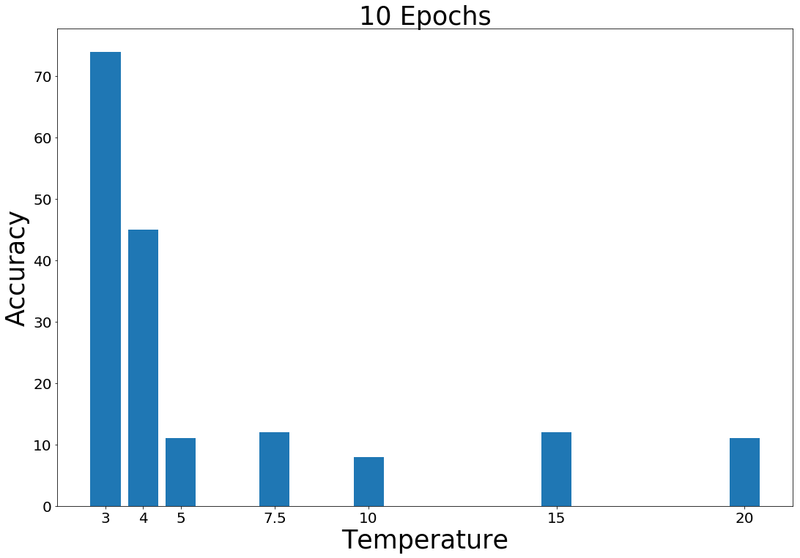

# KnowledgeDistillation (repo in progress)
Idea is to distill knowledge from large model to small model for faster inference and comparatively similar accuracy 

## Dataset
MNIST (available at [link](https://www.kaggle.com/competitions/digit-recognizer/data))

## Model 
Teacher model: BigNet (3 Conv layers, 2 fc) \
Student model: SmallNet (2 Conv layers, 1 fc) \
Distilled model: DistillNet (SmallNet distilled with BigNet regularized with Temp)

## Distillation Technique 
Responsed Based, Offline Distillation

## Results 
| Model | Accuracy | Inference Time |
| --------------- | --------------- | --------------- |
| BigNet    | 97%    |   31.8secs  |
| SmallNet    | 27%    | 18secs    |
| DistillNet  | 73%    | 21secs    |

## Advantages
• get state-of-the-art accuracy \
• with lighter model \
• within less inference time \
• could run models on CPUs \
• can be used even when there are fewer training data available for the student model.

----------------------------------------------
 ## Presentation contains 
 - What is knowledge distillation? 
 - Need for knowledge distillation 
 - Other SOTA techniques for knowledge distillation 
 - My experiment 
 - Future direction in this area 

